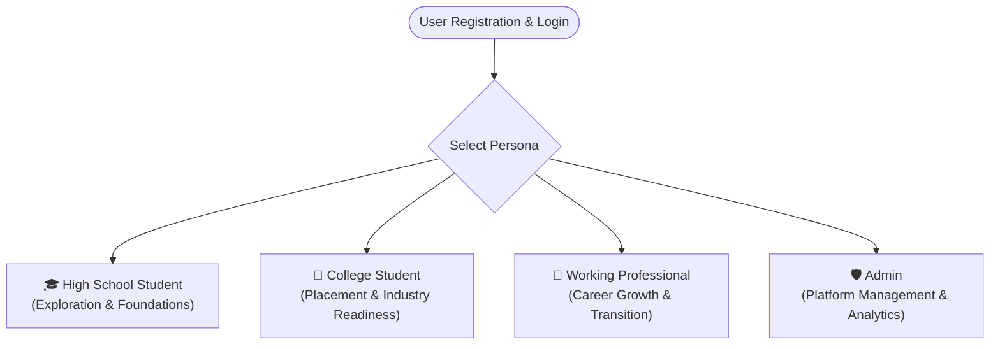
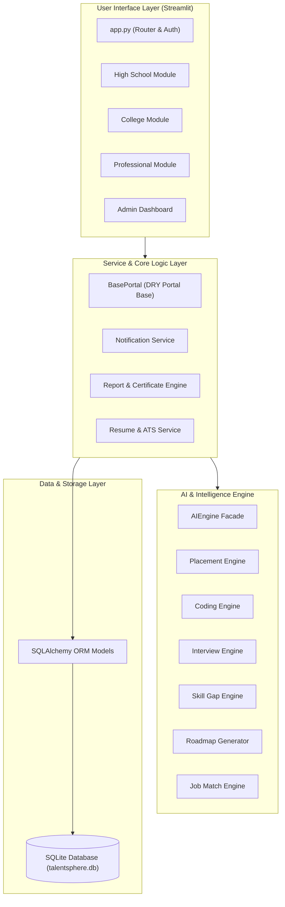
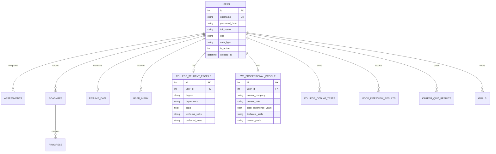

# 🚀 TalentSphere Elevate
### *Next-Generation AI-Powered Career Development & Placement Readiness Platform*

[](https://www.python.org/)
[](https://streamlit.io/)
[](https://www.sqlalchemy.org/)
[](https://plotly.com/)
[](LICENSE)
[]()

---

## 📌 Table of Contents
1. [Overview](#-overview)
2. [Target Audience & Personas](#-target-audience--personas)
3. [Key Features & Capabilities](#-key-features--capabilities)
   - [High School Student Portal](#-high-school-student-portal)
   - [College Student Portal](#-college-student-portal)
   - [Working Professional Portal](#-working-professional-portal)
   - [Admin Management Portal](#️-admin-management-portal)
4. [AI Engine & Intelligence Suite](#-ai-engine--intelligence-suite)
5. [ATS Resume Builder & Analyzer](#-ats-resume-builder--analyzer)
6. [Reports, Analytics & Certifications](#-reports-analytics--certifications)
7. [System Architecture](#-system-architecture)
8. [Technology Stack](#-technology-stack)
9. [Project Directory Structure](#-project-directory-structure)
10. [Database Schema & Data Models](#-database-schema--data-models)
11. [Installation & Setup Guide](#-installation--setup-guide)
12. [Usage & Workflow](#-usage--workflow)
13. [Future Roadmap](#-future-roadmap)
14. [Contributing & License](#-contributing--license)

---

## 🌟 Overview

**TalentSphere Elevate** is a comprehensive, end-to-end career guidance and talent acceleration platform designed to empower individuals across every stage of their academic and professional journey. Powered by intelligent AI engines and interactive analytics, TalentSphere Elevate bridges the gap between skill acquisition, industry readiness, and career advancement.

Whether you are a **high school student** exploring foundational career options, a **college student** gearing up for competitive campus placements, or a **working professional** navigating role transitions and promotions, TalentSphere Elevate delivers personalized roadmaps, real-time assessments, ATS-compliant resume tools, and actionable insights.

---

## 👥 Target Audience & Personas



* **High School Students**: Build early career clarity, practice basic coding and aptitude, cultivate communication skills, and discover personalized educational paths.
* **College Students**: Master placement tests, conduct mock interviews, evaluate resume ATS scores, assess industry readiness, and discover targeted internships.
* **Working Professionals**: Benchmark salaries, assess promotion readiness, plan career switches, close skill gaps, and explore trending technologies.
* **Administrators**: Track platform analytics, manage courses and quiz banks, supervise user activity, and broadcast platform-wide notifications.

---

## 🚀 Key Features & Capabilities

### 🎓 High School Student Portal
Designed to provide engaging, foundational guidance and skill development for secondary school students:
* **Interactive Career Explorer**: Explore diverse modern career paths with descriptions, required subjects, salary outlooks, and entry paths.
* **AI Career Quiz & RIASEC Interest Assessment**: Psychometric and interest evaluation mapping passions to suitable career clusters.
* **Future Skills Roadmap**: Dynamic step-by-step milestones tailored to high school milestones.
* **Daily Learning Tasks**: Gamified daily micro-tasks that build consistency and positive learning habits.
* **Coding Basics Sandbox**: Beginner-friendly programming concepts (Python, Logic, Web fundamentals) with interactive exercises.
* **Aptitude & Logical Reasoning Practice**: Quantitative and reasoning challenges with automated scoring and explanations.
* **Communication Skills Builder**: Verbal, written, and presentation etiquette modules.
* **Goal Tracker & AI Mentor Chatbot**: Track short-term academic goals and chat with an AI mentor for career Q&A.

---

### 🏫 College Student Portal
A rigorous, placement-oriented module tailored to university and engineering students:
* **Placement Readiness Score**: Multi-dimensional gauge combining coding scores, resume strength, mock interviews, and project experience.
* **Interactive Coding Practice Tests**: Topic-wise timed assessments (Data Structures, Algorithms, SQL, OOP, System Design) evaluated by AI.
* **AI Mock Interview Simulator**: Realistic Technical, HR, and Behavioral mock interviews with instant scorecards, answer relevance ratings, and feedback.
* **Skill Gap Analysis**: Compares a student’s current profile with industry role benchmarks (Software Engineer, Data Analyst, Cloud Architect, AI Engineer).
* **Internship Recommendation Engine**: Suggests internships matching the student’s CGPA, technical skills, and location preferences.
* **30/60/90-Day Learning Roadmaps**: Structured milestone trackers with automated progress indicators and checklist persistence.
* **Comprehensive Student Profile**: Manages academic credentials, branch, technical stack, career preferences, and target companies.

---

### 💼 Working Professional Portal
Accelerates corporate career trajectories and navigates transition opportunities:
* **Promotion Readiness Calculator**: Algorithmic scoring based on total experience, project complexity, technical depth, and leadership contributions.
* **Career Transition Matcher**: Analyzes current domain skills against target roles to generate a transition feasibility index and learning priorities.
* **Salary Growth & Market Benchmarks**: Compares compensation with market trends and forecasts salary growth upon acquiring recommended certifications.
* **Trending Industry Skills**: Curated catalog of high-demand skills (GenAI, Cloud/DevOps, Distributed Systems, ML Ops).
* **Automated Growth PDF Reports**: Generates detailed, downloadable executive career growth reports.

---

### 🛡️ Admin Management Portal
Provides centralized control and platform observability:
* **Live System Analytics**: Real-time visualization of total active users, assessment submissions, and system health metrics.
* **User Management**: Search, filter, inspect, and toggle user active/deactivated statuses.
* **Course & Career Path Manager**: Create, edit, and organize courses across multiple categories.
* **Quiz & Question Bank Manager**: Add and update assessment question pools dynamically.
* **Notification Center**: Dispatch targeted alerts and announcements to specific user cohorts or system-wide.

---

## 🤖 AI Engine & Intelligence Suite

The platform utilizes a modular, extensible AI Engine architecture located in the [`ai/`](file:///e:/infosys%20springborad%20internship/Project/ai) package:

| Submodule | Description |
| :--- | :--- |
| **Placement Engine** (`placement_engine.py`) | Calculates aggregate placement readiness indices using weighted multi-factor scoring algorithms. |
| **Resume Analyzer** (`resume_analyzer.py`) | Evaluates keyword density, formatting, section completeness, and provides actionable improvement suggestions. |
| **Coding Engine** (`coding_engine.py`) | Generates topic-wise coding assessments and dynamically grades submissions with topic weakness analysis. |
| **Interview Engine** (`interview_engine.py`) | Evaluates mock interview answers across confidence, communication, technical accuracy, and problem-solving. |
| **Skill Gap Engine** (`skill_gap.py`) | Computes missing technical proficiencies and prioritizes learning suggestions against target roles. |
| **Job Matching Engine** (`job_matching.py`) | Matches candidate skills with real-world job roles and computes compatibility percentages. |
| **Internship Engine** (`internship_engine.py`) | Recommends relevant internships based on student skills, degree, and location. |
| **Roadmap Generator** (`roadmap_generator.py`) | Builds customized 30/60/90-day learning curricula for varied career targets. |

---

## 📄 ATS Resume Builder & Analyzer

Built directly into the platform to prepare users for modern applicant tracking systems:
* **Multi-Template ATS Resume Builder**: Professional, clean resume templates optimized for machine parsing.
* **ATS Compatibility Checker**: Scans resumes against target job descriptions, scoring match percentage and identifying missing critical keywords.
* **Live Resume Preview**: Real-time interactive preview of candidate details, projects, education, and certifications.
* **Direct PDF Export**: High-fidelity PDF generation using ReportLab.

---

## 📊 Reports, Analytics & Certifications

* **Student Info Cards**: Compact, shareable executive summary cards for student performance.
* **Automated PDF Reports**: High-resolution, multi-page PDF progress reports detailing skills, assessment history, and roadmaps.
* **Milestone Completion Certificates**: Generates verifiable certificates upon full completion of learning roadmaps.
* **Visual Progress Trackers**: Interactive Plotly gauges, radar charts, line charts, and bar graphs for immediate visual feedback.

---

## 🏗️ System Architecture



---

## 💻 Technology Stack

* **Frontend & Framework**: [Streamlit](https://streamlit.io/) (Interactive Web Application)
* **Backend & ORM**: Python 3.10+, [SQLAlchemy](https://www.sqlalchemy.org/)
* **Database**: SQLite (Default, embedded), with support for PostgreSQL (`psycopg2-binary`, `alembic`)
* **Security & Auth**: [Bcrypt](https://pypi.org/project/bcrypt/) Password Hashing, Session State Management
* **Data Science & Analytics**: [Pandas](https://pandas.pydata.org/), [NumPy](https://numpy.org/), [Scikit-Learn](https://scikit-learn.org/)
* **Visualization**: [Plotly Express & Graph Objects](https://plotly.com/python/), [Matplotlib](https://matplotlib.org/)
* **Document Processing & PDF Generation**: [ReportLab](https://www.reportlab.com/), [python-docx](https://python-docx.readthedocs.io/), [pdfplumber](https://github.com/jsvine/pdfplumber), [PyPDF2](https://pypi.org/project/PyPDF2/)
* **AI / NLP Integrations**: [Google Generative AI](https://pypi.org/project/google-generativeai/), [NLTK](https://www.nltk.org/), [spaCy](https://spacy.io/)

---

## 📁 Project Directory Structure

```text
TalentSphere/
├── admin/                           # Admin Portal & Management System
│   ├── admin_dashboard.py           # Main Admin dashboard controller
│   ├── analytics.py                 # Platform-wide usage & analytics
│   ├── course_manager.py            # Course & career path management
│   ├── notification_manager.py      # System notification dispatcher
│   ├── quiz_manager.py              # Quiz question bank manager
│   └── user_manager.py              # User status & account management
├── ai/                              # Modular AI Intelligence Engines
│   ├── __init__.py                  # AIEngine facade
│   ├── career_predictor.py          # Career prediction model
│   ├── coding_engine.py             # Assessment generator & grader
│   ├── internship_engine.py         # Internship matching logic
│   ├── interview_engine.py          # Mock interview simulation & scoring
│   ├── job_matching.py              # Job role match calculation
│   ├── placement_engine.py          # Placement readiness score engine
│   ├── recommendation_engine.py     # Course & skill recommendations
│   ├── resume_analyzer.py           # ATS & resume review engine
│   ├── roadmap_generator.py         # 30/60/90-day roadmap synthesis
│   └── skill_gap.py                 # Skill gap & priority engine
├── modules/                         # Core User Persona Modules
│   ├── base_portal.py               # Shared BasePortal architecture
│   ├── career_data.py               # Pre-configured career benchmarks & data
│   ├── career_explorer.py           # Interactive career exploration logic
│   ├── college.py                   # College Student portal
│   ├── high_school.py               # High School Student portal
│   ├── working_professional.py      # Working Professional portal
│   ├── wp_logic.py                  # Professional promotion/transition logic
│   ├── wp_models.py                 # Professional SQLAlchemy models
│   ├── wp_report.py                 # Professional growth PDF report builder
│   ├── college_features/            # Dedicated college sub-features
│   │   └── college_profile.py       # Academic & placement profile UI
│   └── hs_features/                 # Dedicated high school sub-features
│       ├── ai_mentor.py             # AI Chatbot mentor for students
│       ├── aptitude_practice.py     # Logical reasoning practice tests
│       ├── career_quiz.py           # Psychometric career quiz
│       ├── coding_basics.py         # Beginner coding exercises
│       ├── communication_skills.py  # Soft skills training
│       ├── daily_tasks.py           # Gamified daily learning tasks
│       ├── future_roadmap.py        # High school milestone roadmaps
│       ├── goal_tracker.py          # Goal tracking & milestones
│       ├── interest_assessment.py   # RIASEC interest assessment
│       └── personal_information.py  # High school student profile UI
├── notifications/                   # Notification Subsystem
│   ├── notification_service.py      # Notification delivery & DB storage
│   ├── notification_ui.py           # In-app notification drawer & inbox
│   └── reminder_engine.py           # Automated task reminder triggers
├── reports/                         # PDF & Certificate Reporting Engines
│   ├── certificate_generator.py     # Roadmap milestone certificates
│   ├── pdf_report.py                # High-resolution PDF progress reports
│   ├── report_engine.py             # Comprehensive reporting aggregator
│   └── student_info_card.py         # Visual student summary cards
├── resume/                          # ATS Resume Suite
│   ├── ats_checker.py               # ATS keyword & format evaluator
│   ├── pdf_export.py                # PDF resume export pipeline
│   ├── resume_builder.py            # Interactive builder form
│   └── templates.py                 # Standard ATS-friendly templates
├── app.py                           # Application Entry Point & Authentication
├── database.py                      # SQLAlchemy Database Schema & Session Manager
├── requirements.txt                 # Project Dependencies
├── LICENSE                          # MIT License
└── README.md                        # Project Documentation
```

---

## 🗄️ Database Schema & Data Models

TalentSphere uses an integrated SQLite relational database (`talentsphere.db`) managed via SQLAlchemy ORM. Key tables include:



---

## ⚡ Installation & Setup Guide

### 1. Prerequisites
Ensure you have **Python 3.10** or higher installed on your system.

### 2. Clone the Repository
```bash
git clone https://github.com/yashlohar9005/TalentSphere.git
cd TalentSphere
```

### 3. Create & Activate a Virtual Environment
* **On Windows (PowerShell):**
  ```powershell
  python -m venv venv
  .\venv\Scripts\Activate.ps1
  ```
* **On Linux / macOS:**
  ```bash
  python3 -m venv venv
  source venv/bin/activate
  ```

### 4. Install Dependencies
```bash
pip install --upgrade pip
pip install -r requirements.txt
```

### 5. Launch the Application
```bash
streamlit run app.py
```
Once launched, open your browser at `http://localhost:8501`.

---

## 🎯 Usage & Workflow

1. **Sign Up / Login**: Create a user profile and choose your persona (**High School Student**, **College Student**, **Working Professional**, or **Admin**).
2. **Setup Your Profile**: Navigate to the Profile tab to enter academic or professional background details.
3. **Take Assessments**: Complete domain assessments, coding practice tests, or mock interviews.
4. **Generate Your Roadmap**: Click *Generate Roadmap* to receive an AI-crafted 30/60/90-day learning curriculum.
5. **Build an ATS Resume**: Format your resume with industry-standard templates and run real-time ATS compatibility checks.
6. **Download Reports & Certificates**: Export progress reports and milestone certificates as PDFs.

---

## 🗺️ Future Roadmap

- [ ] **Real-Time Voice AI Interviews**: Integrate WebRTC-based voice speech analysis for mock interviews.
- [ ] **GitHub & LinkedIn Integration**: Direct profile parsing and repository portfolio analysis.
- [ ] **Multi-Tenant College Admin Portals**: Dedicated dashboards for university placement officers and corporate recruiters.
- [ ] **Expanded Multi-Language Support**: Support for regional languages across high school modules.

---

## 📄 License & Acknowledgments

This project is developed as part of the **Infosys Springboard Internship Program**.

Distributed under the **MIT License**. See [LICENSE](LICENSE) for more details.

---
<p align="center">
  <b>Built with ❤️ by Yash Lohar & the TalentSphere Elevate Team</b><br/>
  <i>Empowering Careers through AI Intelligence</i>
</p>